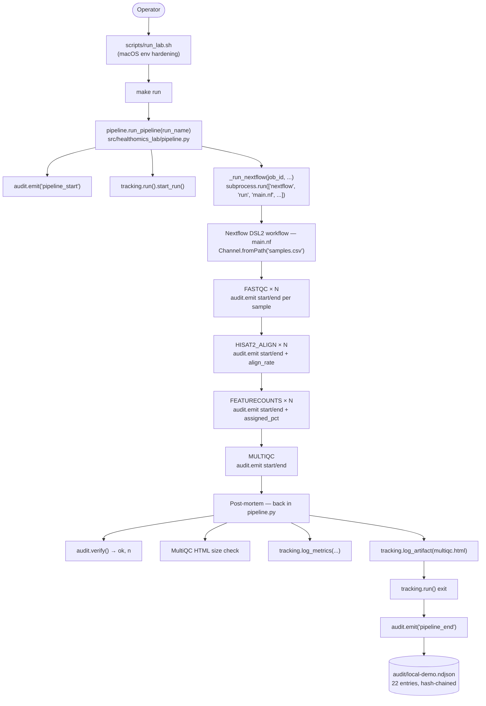

# Architecture, `healthomics-lab-orchestrator`

This repo composes two layers that the scaffold template kept separate:

1. **Outer layer**: the scaffold's standard
   `audit_start -> tracking_start -> body -> tracking_end -> audit_end`
   bracket, implemented in `src/healthomics_lab/pipeline.py`.
2. **Inner layer**: a Nextflow DSL2 pipeline (`main.nf`) with four
   processes that each emit their own audit entries via a CLI substrate
   hook (`src/healthomics_lab/process_hooks.py`).

The result is a single hash-chained NDJSON ledger that spans both layers
linearly, so a substrate consumer reads one chain and sees the entire run
end-to-end.

---

## Two-layer control flow



---

## Audit chain composition

A single `make run` invocation produces an audit chain with the following
shape on the n=3 demo cohort:

| Position | Action | Source | Count |
|---|---|---|---|
| 1 | `pipeline_start` | pipeline.py outer bracket | 1 |
| 2-7 | `fastqc_start` / `fastqc_end` | main.nf FASTQC process | 6 |
| 8-13 | `hisat2_align_start` / `hisat2_align_end` | main.nf HISAT2_ALIGN | 6 |
| 14-19 | `featurecounts_start` / `featurecounts_end` | main.nf FEATURECOUNTS | 6 |
| 20-21 | `multiqc_start` / `multiqc_end` | main.nf MULTIQC | 2 |
| 22 | `pipeline_end` | pipeline.py outer bracket | 1 |
| | | **total** | **22** |

The ordering is wall-clock monotonic, not lexical: Nextflow can run
`FASTQC(SRR1039508)` and `HISAT2_ALIGN(SRR1039509)` concurrently when the
DAG allows it, so the per-process entries interleave across samples and
stages. Each entry carries a `prev_hash` field. `audit.verify()` walks the
chain in insertion order and checks that each entry's `prev_hash` equals
the SHA-256 of the canonical encoding of the entry immediately before it.

---

## The fence-post in `pipeline_end`

The `pipeline_end` entry includes `audit_chain_entries` in its `metrics`
field as a self-describing summary. That count is read *before*
`pipeline_end` itself is appended:

```python
# Inside run_pipeline(), post-mortem section:
ok, n_entries, _ = audit.verify(ledger)
metrics["audit_chain_entries"] = float(n_entries)
# ... tracking.log_metrics(metrics) ...

# Then, outside the `with tracking.run()` block:
audit.emit(
    action="pipeline_end",
    job_id=job_id,
    fields={"status": status, "metrics": metrics, ...},
)
```

So the on-ledger count when `pipeline_end` is written is `n+1` (where `n`
is the value embedded inside that entry's `metrics`). On the demo cohort
the embedded value is 21 and the final on-disk length is 22.

This is deliberate. Putting the count inside the `pipeline_end` entry
makes the chain self-describing without requiring the closing entry to
contain a forward reference to itself. A forward reference would be either
circular (the entry's own `prev_hash` depends on its content, which would
include the count) or would require a two-pass write (count, then re-hash).
The fence-post avoids both problems.

---

## Substrate integration points

This repo connects four loosely-coupled channels. Three are shared with
the scaffold template; the fourth (`HEALTHOMICS_AUDIT_LEDGER`) is specific
to this orchestrator's per-process hook design:

| Channel | Module | Env var | Substrate endpoint |
|---|---|---|---|
| Audit (immutable record) | `healthomics_lab.audit` | `AUDIT_HOST` | `http://${AUDIT_HOST}/events` |
| MLflow (experiment tracking) | `healthomics_lab.tracking` | `MLFLOW_TRACKING_URI` | configurable |
| Canary (daily probe) | `healthomics_lab.canary` | `HEALTHOMICS_LAB_CANARY_FIXTURE` | invoked by `lab_semantic_check.py` |
| Per-process audit (orchestrator-specific) | `healthomics_lab.process_hooks` | `HEALTHOMICS_AUDIT_LEDGER` | shared local ledger |

The `HEALTHOMICS_AUDIT_LEDGER` env var is set by `nextflow.config` to an
absolute path so per-task work-dir isolation (Nextflow gives each task its
own `work/<hash>/` directory) does not fragment the audit chain.

All four channels degrade to no-ops when the substrate is absent. The
deterministic local NDJSON ledger remains the source of truth for audit
even when a remote post fails.

---

## Process-level environment hardening (macOS specifics)

`nextflow.config`'s `env { PATH = ... }` block prepends four tool families
in this priority order:

```
1. ${projectDir}/.venv/bin     -> venv python + healthomics_lab pkg
2. /opt/homebrew/bin            -> brew nextflow + brew CLIs
3. /usr/bin                     -> system Java 19.0.1 (Nextflow-compatible)
4. ${HOME}/miniconda3/bin       -> bioconda tools (fastqc/hisat2/...) + conda
5. ${shell PATH}                -> everything else from parent shell
```

This order resolves a four-way conflict that surfaces on macOS
when `(base)` conda is active:

- Conda exports a `JAVA_HOME` pointing at miniconda Java 25 LTS, which
  Nextflow 23.04 rejects. `scripts/run_lab.sh` runs `conda deactivate` +
  `unset JAVA_HOME JAVA_CMD` to fall back to `/usr/bin/java` 19.0.1.
- `conda deactivate` removes both conda python (breaking the substrate
  hooks) and bioconda CLIs (breaking the Nextflow processes). Both
  `${projectDir}/.venv/bin` and `${HOME}/miniconda3/bin` are restored to
  PATH via the `env` block above.

See `docs/tooling-versions.md` for the lesson trail (L-phi / L-psi /
L-omega / L-alpha2 / L-beta2 / L-chi) and `scripts/run_lab.sh` for the
launch-time hardening.

---

## Why MLflow alongside audit

Three reasons, in order:

1. **Aggregate metric search**: MLflow's UI surfaces `wall_clock_seconds`,
   `audit_chain_entries`, and `multiqc_report_bytes` across runs so a
   reviewer can compare performance over time without re-parsing audit files.
2. **Substrate consistency**: other repos in this portfolio post to the same
   MLflow server, so a reviewer can compare runs across projects in one
   browser tab.
3. **No-op when absent**: the wrapper means the demo works without an
   MLflow server, so anyone cloning the repo on a laptop still gets a
   successful `make run` without any extra setup.

The audit chain is the *source of truth* (deterministic, tamper-evident,
local-first). MLflow is the *search index* (queryable, comparative,
remote-first). They are complementary, not redundant.

---

## What this architecture intentionally avoids

- **No DAG engine besides Nextflow.** Airflow, Prefect, Dagster, Argo
  Workflows, Cromwell, all are valid choices for bioinformatics
  orchestration; this demo specifically picks Nextflow because nf-core
  has standardized the pattern for clinical RNA-seq. The substrate hooks
  are engine-agnostic.
- **No microservices.** Outer Python orchestrator + one Nextflow subprocess
  + four Nextflow processes is the entire surface.
- **No container engine.** See `docs/what-is-out-of-scope.md` for the
  containers section. Host-installed tools via bioconda + the four-family
  PATH dance is the v0.1 alternative.
- **No data validation framework beyond Pydantic-on-demand.** The samples
  sheet is a plain CSV read by Nextflow; the manifest is a plain YAML.
  Pydantic appears only where the substrate POSTs need structured payloads.
- **No retry / backoff inside the pipeline.** Nextflow's own retry support
  is intentionally not turned on (`errorStrategy = 'terminate'` in
  `nextflow.config`) so failures surface immediately in the audit chain.
  Production hardening belongs in a deployment-tier repo.

This architecture defines the contract between the orchestration demo and
the substrate. The contract is small and the implementation is small;
expansion happens through additive profiles and PRs, not by re-architecting.
